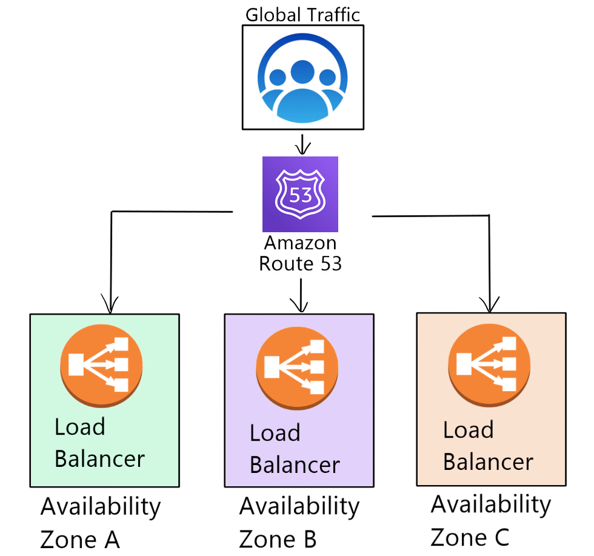

# Terraform and Benefits

## Terraform
- leader in orchestration
- Ansible used for configuration management
- Terraform used for orchestration
- most lightweight than Ansible
- allows multi-cloud setup
- more concise than Ansible
- easy to set up

### Terraform most used commands
- `terraform init` - initiate terraform with required dependencies of the provider mentioned in `main.tf`
- `terraform plan` - check syntax of code
- `terraform apply` - run `.tf` file
- `terraform destroy` - destroys current resources

### Securing AWS keys with Terraform
- on Windows
  - in Search find `System (Control Panel)`
  - click `Advanced System Settings`
  - click `Environment variables`
  - in the `Edit System Variable` window, specify the value of the PATH environment variable
  - name env variables as `AWS_ACCESS_KEY_ID` and `AWS_SECRET_ACCESS_KEY`

- key protection methods are validated by AWS
- terraform has a contract with AWS about access key variables

### Terraform to launch ec2 with VPC, subnets, SG


web ami: ami-09f4421394f9096d9
db ami: ami-098bc304c16c31c4b

- create Terraform env to access our AMI to launch ec2 instance

```
provider "aws"{
    region = "eu-west-1"
}

resource "aws_instance" "app_instance"{
    ami = "ami-09f4421394f9096d9"
    instance_type = "t2.micro"
    associate_public_ip_address = true
    tags = {
        Name = "eng84_isobel_terraform_node_app"
    }
}
```

## Types of cloud
- we are given shared space in a data centre, e.g. in Ireland
- if something happens to the data centre (e.g. fire, theft) we are all affected
- hybrid cloud costs more, as it involves maintaining on premises servers
- AWS has a gov cloud for government sector only, and data centres we can't buy

### Public cloud

- infrastructure based on provider data centres
- not as secure
- cheaper
- scalable

### Private cloud

- data centre based in the organisation
- secure
- expensive

### Hybrid cloud

- a combination of private and public cloud
- expensive
- sensitive data can be stored securely, while still allowing scalability

## Load Balancers

### Network Load Balancer
- switches between the tasks, e.g. payment gateway

### Classic Load Balancer
- works between the different availability zones
- redirects traffic if one AZ is down

### Auto-Scaling Groups
- vertical scaling increases the size of our existing servers
- horizontal scaling creates new servers of the same configuration
- auto-scaling automatically scales our instances based on set criteria
- needed in order to make our app highly available
- scaling out is generally preferred as it increases availability, and saves money by reducing unused capacity


### Route 53
- Domain Name System (DNS), allowing users to connect to a site using a domain name, rather than an IP
- it can also redirect traffic from multiple regions to load balancers


